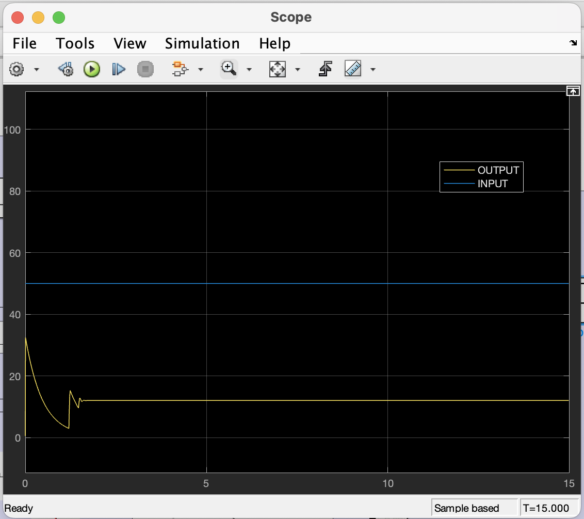
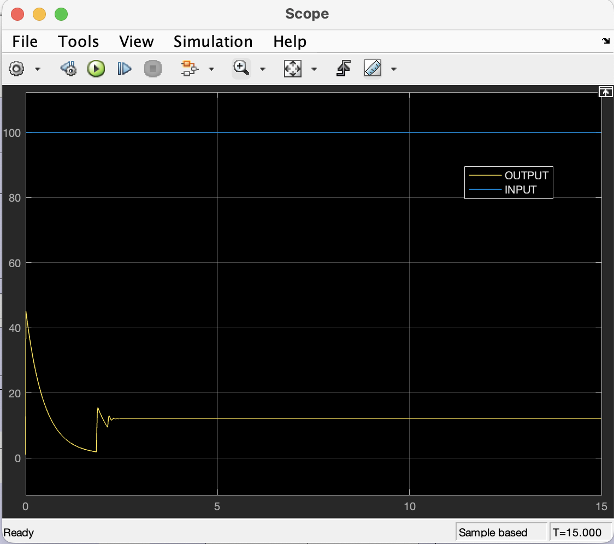
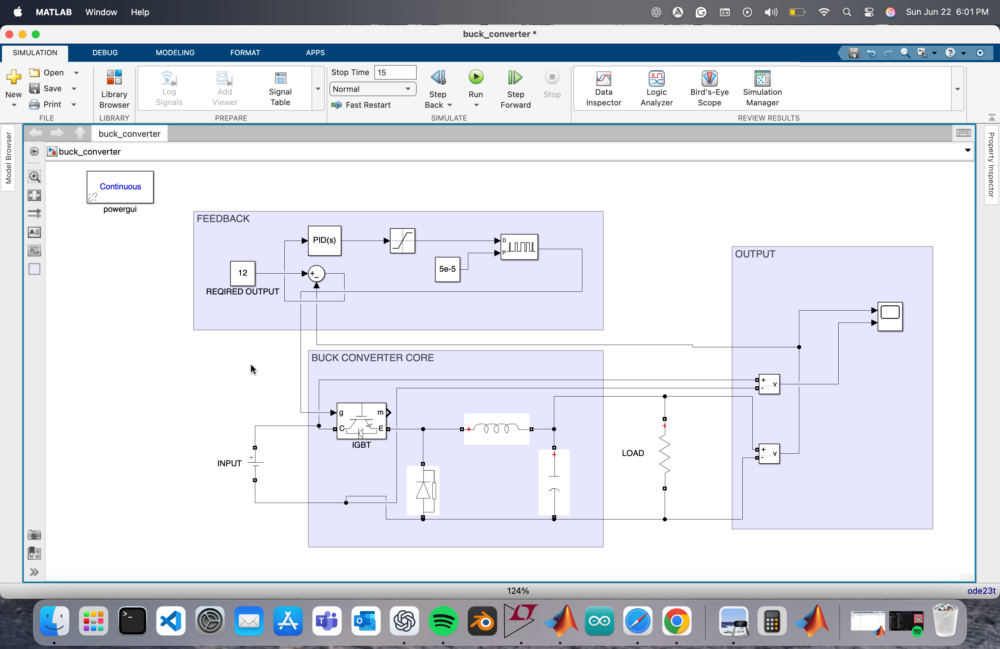

# Buck-Converter-ClosedLoop
Simulink model of a closed-loop buck converter using IGBT switching and PID control.
# Closed-Loop Buck Converter – Simulink Project

This is a MATLAB/Simulink project where I built and simulated a closed-loop buck converter using IGBT switching and a PID controller. The goal was to dynamically regulate the output voltage even when the input voltage or load conditions change. The converter was tuned for a fast response and minimal output ripple.

---

 What I Did

- Designed a buck converter in Simulink using power electronics components
- Implemented PWM switching using an IGBT block
- Used a PID controller to automatically adjust duty cycle in real time
- Tuned the system to maintain the output around 12V under varying input and load
- Observed stable performance and ripple-free regulation in simulation

---

 Project Files

| File | Description |
|------|-------------|
| `buck_converter_model.slx` | The main Simulink model |
| `output_plot.png` | Screenshot of the output voltage waveform |
| `model_diagram.png` | Overview of the full converter system layout |

---

Tools Used

- MATLAB R2023b
- Simulink
  

---

 To Run the Model

1. Open the `.slx` file in Simulink
2. Run the simulation
3. You can check the Scope inside the model or refer to the screenshots provided

---

Output Example

---

 Model Architecture

